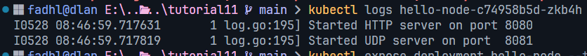
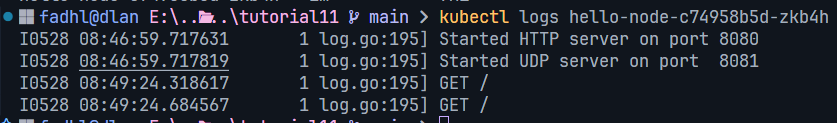
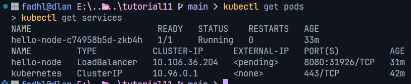
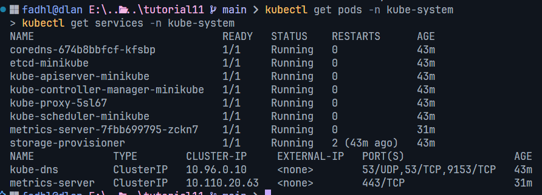
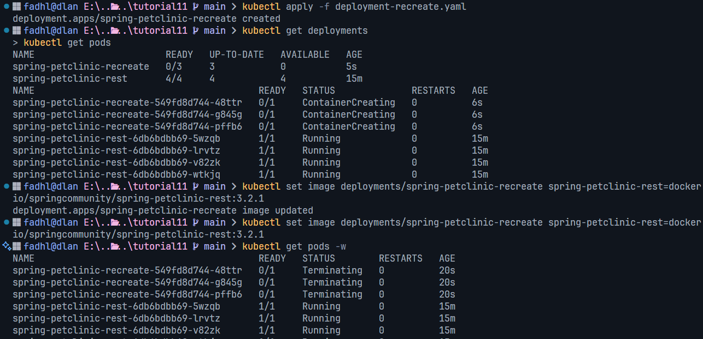

# deployment-monitoring-tutorial

## Reflection on Hello Minikube

### 1. Compare the application logs before and after you exposed it as a Service. Try to open the app several times while the proxy into the Service is running. What do you see in the logs? Does the number of logs increase each time you open the app?

Before:

After:

*Yes, the number of logs increases each time I access the app because each HTTP request to the service is logged by the application. This demonstrates that the Service is successfully routing external traffic to the Pod.*

### 2. Notice that there are two versions of `kubectl get` invocation during this tutorial section. The first does not have any option, while the latter has `-n` option with value set to `kube-system`. What is the purpose of the `-n` option and why did the output not list the pods/services that you
explicitly created?

Without -n:

With -n:

*The `-n` option in kubectl stands for "namespace" and is used to specify which Kubernetes namespace to query or operate on.*

*When we ran `kubectl get pods` and `kubectl get services` without the `-n` option, it showed resources in the `default` namespace, which included our hello-node deployment and service.*

*When we ran `kubectl get pods,services -n kube-system`, it showed resources in the `kube-system` namespace, which contains system-level components like:*
- *coredns (DNS server)*
- *etcd (key-value store)*
- *kube-apiserver (API server)*
- *metrics-server (resource monitoring)*

*The output didn't list the pods/services we explicitly created because those were created in the `default` namespace, while the `-n kube-system` command only shows resources in the `kube-system` namespace. Kubernetes uses namespaces to logically separate and organize resources, providing isolation between different applications or environments.*

## Reflection on Rolling Update & Kubernetes Manifest File

### 1. What’s the difference between Rolling Update and Recreate deployment strategies?

The difference between the **Rolling Update** and **Recreate** deployment strategies in Kubernetes lies in how they handle updating applications and managing downtime.

*In a **Rolling Update**, the application is updated gradually by replacing old pods with new ones one at a time. This approach ensures high availability since some of the old pods remain active while the new pods are being created. It is the default strategy in Kubernetes and supports rollback if something goes wrong. The speed and behavior of the update can also be controlled using parameters like `maxSurge` and `maxUnavailable`.*

*On the other hand, the **Recreate** strategy stops all existing pods before starting new ones. This means there will be a period of downtime during the deployment because no pods are running while the update takes place. It’s a simpler approach and is suitable when the old and new versions of an application cannot run at the same time. However, the main drawback is that the application becomes temporarily unavailable during the update process.*

### 2. Deploy the Spring Petclinic REST app using the Recreate strategy. Try it out and make notes on what happened during the process.

*I attempted to deploy Spring Petclinic REST using the Recreate deployment strategy with the following steps:*

1. ***Created deployment-recreate.yaml** with `strategy.type: Recreate`.*
2. ***Initial deployment**: Applied the manifest and verified 3 pods were running with version 3.0.2.*
3. ***Performed update**: Used `kubectl set image` to update to version 3.2.1.*
4. ***Observed behavior**: All 3 pods were terminated simultaneously, then 3 new pods were created with the new image.*
5. ***Downtime occurred**: There was a brief period (approximately 30-45 seconds) where no pods were available.*

*Key observations:*
- *All old pods showed "Terminating" status at the same time*
- *New pods were only created after all old pods were completely removed*
- *The service was temporarily unavailable during the transition*
- *Update completed faster than rolling update since there's no gradual replacement*

### 3. Create different YAML manifest files Set them up to use the Recreate deployment strategy.

*I prepared separate manifest files for Recreate deployment strategy:*

*1. **deployment-recreate.yaml**: Contains the Deployment configuration with `strategy.type: Recreate`*
*2. **service-recreate.yaml**: Contains the Service configuration to expose the application*

*Key differences from Rolling Update manifests:*
- *Deployment manifest specifies `strategy.type: Recreate` instead of `RollingUpdate`*
- *No `maxSurge` or `maxUnavailable` parameters needed since all pods are replaced at once*
- *Service manifest remains the same as it only defines how to expose the pods*

### 4. Reflect on using Kubernetes manifest files. Think about the benefits of using manifest files compared to deploying the app manually. Share your experience using the kubectl apply -f command.

*Reflecting on my experience using Kubernetes manifest files, I found them to be significantly more effective than deploying applications manually using individual `kubectl` commands. Manifest files allow configurations to be stored as code, making them version-controlled and easy to review. This helps track changes over time and ensures consistency across different environments, reducing the chances of human error or missed parameters during deployment.*

*Using `kubectl apply -f` simplifies the entire process into a single command, which is especially useful when integrating with CI/CD pipelines. Manifest files also act as living documentation, making it easier for team members to understand and collaborate on the infrastructure setup. Overall, this approach has made deployments faster, more reliable, and easier to manage.*
